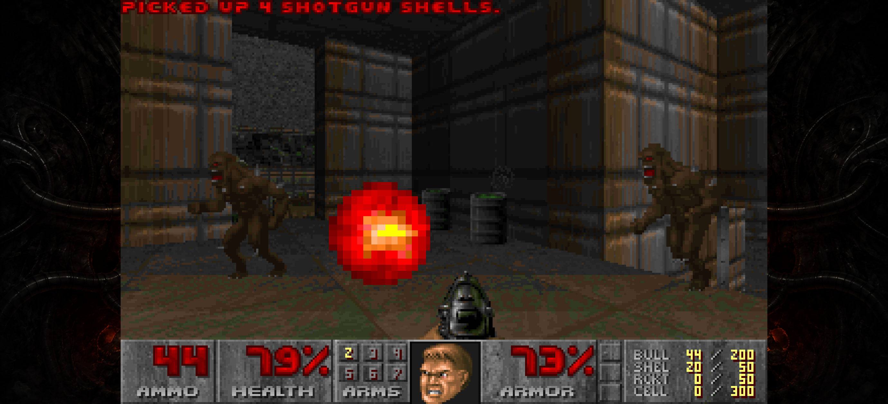
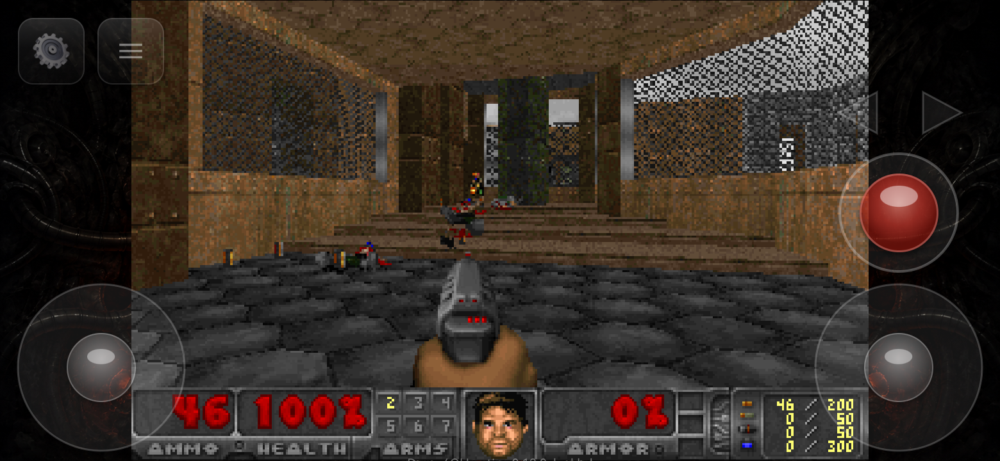
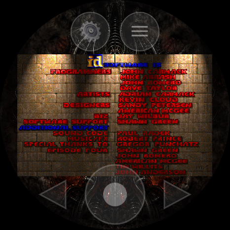

# FreeDoom4OpenHarmony

DOOM for **HarmonyOS** and **OpenHarmony** - phone and smartwatch. A port of
[doomgeneric](https://github.com/ozkl/doomgeneric) with a native C/NAPI platform
layer and an ArkTS/ArkUI touch overlay, shipping the free
[Freedoom](https://freedoom.github.io/) game data so it runs out of the box.


| Phone (HarmonyOS) | Phone (Oniro) | Watch |
|---|---|---|
|  |  |  |

## Features

- **One app, two device HAPs** - a phone HAP and a Huawei Watch HAP built from
  one Hvigor project (bundle `org.pmandes.fd4ohos`). Both share the same native
  engine, platform layer and game data through a common `doom` HAR, so engine
  work is done once.
- **Runs out of the box** - bundles Freedoom Phase 1 (`freedoom1.wad`); no
  external WAD required. Custom IWADs can be imported (phone), downloaded
  (watch) or pushed with `hdc` (both).
- **Native rendering** - the 320x200 frame is presented through an XComponent
  `SURFACE` / `NativeWindow`, upscaled nearest-neighbor for a crisp,
  pixel-perfect image (no bilinear blur).
- **Sound and music** - SFX and MIDI music mixed on OHAudio (44.1 kHz stereo).
  Music is rendered by [FluidLite](https://github.com/divideconcept/FluidLite),
  a dependency-free FluidSynth core, with reverb and chorus enabled, driving the
  bundled `TimGM6mb.sf2` General MIDI soundfont. A Roland SC-55 SoundFont can be
  side-loaded for the authentic DOOM sound (see [Music](#music-soundfonts)).
- **Touch controls** - a dual-stick overlay on the phone; a joystick, the digital
  crown and tap-to-fire on the watch. Physical keyboards are supported on the
  phone.
- **Auto-save** - save slots are named automatically (`E1M1 HH:MM DD/MM`), no
  on-screen keyboard needed.
- **Graceful lifecycle** - pause/resume on background, audio-focus handling,
  clean shutdown from the in-game Quit menu.

## Repository layout

```
FreeDoom4OpenHarmony/
  app/                 Hvigor / DevEco Studio project (bundle org.pmandes.fd4ohos)
    AppScope/          bundle metadata (name, icon, version)
    build-profile.json5  products: default (phone) and watch (wearable)
    doom/              shared HAR: doomgeneric engine, OHOS platform layer (video,
                       input, audio, FluidLite music), NAPI bridge, DoomEngine.ets,
                       plus freedoom1.wad and TimGM6mb.sf2 as rawfile
    core/              shared HAR: device-agnostic model and repositories (settings,
                       WAD and soundfont storage) behind the phone's MVVM UI
    entry-phone/       phone HAP  (module entry_phone, PhoneEntryAbility)
    entry-watch/       watch HAP  (module entry_watch, WatchEntryAbility)
  assets/              screenshots
```

`app/` is **one Hvigor project with two products**: `default` builds the phone
HAP (`entry_phone`), `watch` builds the wearable HAP (`entry_watch`). Both
depend on the `doom` HAR; its native library, ArkTS bridge and rawfile game data
are merged into each HAP at build time. The phone HAP additionally uses the
`core` HAR for its settings and file-storage layer. Open `app/` as the project
root in DevEco Studio, not the repository root.

Native code is built for `arm64-v8a` (devices) and `x86_64` (emulator).

## Requirements

- [DevEco Studio](https://developer.huawei.com/consumer/en/deveco-studio/) 6.0.2
  or newer (the project uses Hvigor model version 6.0.2), or the matching DevEco
  Command Line Tools
- [DevEco CLI](https://gitcode.com/openharmony-sig/deveco-cli) (`devecocli`) -
  wraps the DevEco toolchain (build, run, device control, emulators, logging)
  into a single command; used for the command-line builds below
- HarmonyOS / OpenHarmony SDK, API 20 (6.0.0) or newer
  (the phone product targets 6.0.2 / API 22, the watch product 6.1.0 / API 23)
- `hdc` (bundled with the SDK) for deployment
- A device or emulator: HarmonyOS phone / Huawei Watch, or an Oniro / OpenHarmony 6.x device

## Build and run

### With DevEco Studio

1. Open **`app/`** as the project.
2. **Configure signing** in File > Project Structure > Signing Configs
   (`signingConfigs` is intentionally empty in this repo; automatic signing needs
   a Huawei developer account, a debug / self-signed profile is fine for local
   devices). One signing config covers both products; connect the phone and the
   watch so the debug profile includes both devices.
3. Pick the product with the **Product** button in the top-right corner of
   the IDE (`default` = phone, `watch` = wearable) and click Apply. Then choose
   the matching run configuration (`entry_phone` / `entry_watch`) and device,
   and press Run, or Build > Build Hap(s).

### From the command line (no IDE)

You need the SDK and the bundled command-line tools (`node`, `ohpm`, `hvigor`,
`hdc`) that ship with DevEco Studio or the DevEco Command Line Tools. Point
`DEVECO_SDK_HOME` at the SDK first:

```
# bash
export DEVECO_SDK_HOME="<DevEco Studio>/sdk"
# PowerShell
$env:DEVECO_SDK_HOME = "<DevEco Studio>\sdk"
```

**Option A - devecocli** (the tool used to produce the tested builds):

```
cd app
devecocli build --product default --build-mode debug   # phone HAP
devecocli build --product watch   --build-mode debug   # watch HAP
```

**Option B - Hvigor directly** (the underlying build system). Add the bundled
tools under `<DevEco Studio>/tools/` (`node`, `ohpm/bin`, `hvigor/bin`) to PATH,
then:

```
cd app
ohpm install
hvigor assembleHap --mode module -p product=default -p buildMode=debug --no-daemon
hvigor assembleHap --mode module -p product=watch   -p buildMode=debug --no-daemon
```

The `hvigorw` wrapper is not committed; use the bundled `hvigor`, or let DevEco
generate the wrapper once.

Both produce the HAPs at
`entry-phone/build/default/outputs/default/entry_phone-default-signed.hap` and
`entry-watch/build/watch/outputs/default/entry_watch-default-signed.hap` (a
signing config must be set, see above; without one only `*-unsigned.hap` is
produced). Use `--build-mode release` / `buildMode=release` for a release build.

### Native layer only (NDK + CMake)

Hvigor compiles the C/C++ engine, the platform layer and the vendored FluidLite
for you. To build `libdoom.so` on its own against the OpenHarmony NDK toolchain:

```
cmake -G Ninja -S app/doom/src/main/cpp -B build-native \
  -DOHOS_ARCH=arm64-v8a -DOHOS_STL=c++_shared \
  -DCMAKE_TOOLCHAIN_FILE="$DEVECO_SDK_HOME/default/openharmony/native/build/cmake/ohos.toolchain.cmake"
cmake --build build-native
```

Packaging the full HAP still goes through Hvigor / devecocli.

### Deploy

Build, install and launch in one go:

```
cd app
devecocli run --product default --module entry_phone --device <phone>
devecocli run --product watch   --module entry_watch --device <watch>
```

Or by hand with `hdc`:

```
# phone
hdc -t <device> install -r app/entry-phone/build/default/outputs/default/entry_phone-default-signed.hap
hdc -t <device> shell aa start -b org.pmandes.fd4ohos -a PhoneEntryAbility
# watch
hdc -t <device> install -r app/entry-watch/build/watch/outputs/default/entry_watch-default-signed.hap
hdc -t <device> shell aa start -b org.pmandes.fd4ohos -a WatchEntryAbility
```

The phone HAP also installs and runs on **Oniro / OpenHarmony 6.x** devices
(tested on the Volla Phone X23).

Logs are tagged `Doom4OH`:

```
hdc -t <device> shell "hilog -x" | grep Doom4OH
```

## Controls

**Phone** (landscape):

- **Left stick** - move (forward / back, strafe left / right)
- **Right stick** - turn left / right
- **Fire button** (red) - shoot (also confirms menus)
- **Weapon buttons** (arrows) - next / previous weapon
- **Tap the screen** - use (open doors, flip switches)
- **Settings button** and **menu button** (menu = Escape)
- **USB / Bluetooth keyboard** - arrows, Ctrl = fire, Space = use, Shift = run,
  number keys = weapons, `[` / `]` = previous / next weapon, Esc = menu, letters
  for cheats and prompts

**Watch:**

- **Joystick** - move (forward / back, strafe left / right)
- **Rotate the crown** - turn left / right (turning runs, so the vanilla turn
  rate is doubled)
- **Tap the screen** - fire / use / confirm
- **Weapon buttons** (triangles) - previous / next weapon
- **Settings button** and **menu button** (menu = Escape)

The system back gesture is disabled on the watch so a swipe while strafing does
not leave the game; quit from the in-game menu.

## Game data (WADs)

The app ships Freedoom Phase 1 (`freedoom1.wad`) and starts with it by default.
Only DOOM-engine IWADs are supported (Freedoom, DOOM, DOOM II, Final Doom, Chex
Quest); Heretic, Hexen and Strife use their own engines and will not run.

Both apps list every `.wad` found in `files/wads/` of the app sandbox and let
you pick one from the settings screen (the **⚙** button on the game screen).

**Phone - import from storage:**

1. Tap **⚙** (Game section) > **+ Import WAD…** and pick a `.wad` in the system
   file picker; it is copied into the sandbox and appears in the list.
2. Tap the WAD to select it (✓), then **Restart** in the pending bar. The game
   restarts with the chosen IWAD. Long-press an imported WAD (🗑) to remove it.

**Watch - download over the network:**

1. Tap **⚙**, then the blue **↓** button to open the **Download WAD** list
   (Freedoom Phase 1 / 2, The Ultimate Doom, Doom, Doom II, Final Doom
   Plutonia / TNT, Chex Quest).
2. Tap a title; the ZIP is downloaded and unpacked on the watch, then **×**
   goes back to the slot list.
3. Tap the WAD to select it (✓), then the green **✓** to apply. The game
   restarts with the chosen IWAD.
4. To remove a downloaded WAD, long-press it (🗑), then confirm with **✓** or
   cancel with **×**.

**Any device - push over `hdc`:** copy the file straight into the sandbox, then
select it in the settings screen as above (the sandbox path contains the HAP
module name: `entry_phone` or `entry_watch`):

```
# phone
hdc -t <device> file send -b org.pmandes.fd4ohos doom2.wad data/storage/el2/base/haps/entry_phone/files/wads/doom2.wad
# watch
hdc -t <device> file send -b org.pmandes.fd4ohos doom2.wad data/storage/el2/base/haps/entry_watch/files/wads/doom2.wad
```

## Music (soundfonts)

Music is rendered from the WAD's MUS tracks through MIDI with FluidLite. The
bundled `TimGM6mb.sf2` (6 MB, General MIDI) is used by default. For the sound
DOOM's music was composed on, load a **Roland SC-55** SoundFont; it takes
precedence over the bundled one at the next start.

**Phone - from the app:** settings screen (**⚙**), **Audio** section >
**+ Load .sf2…**, pick an `.sf2`, then **Restart** in the pending bar.
**Remove custom** reverts to the built-in one.

**Any device - over `hdc`:** copy the file into the sandbox as
`files/soundfont.sf2` (the sandbox path contains the HAP module name):

```
# phone
hdc -t <device> file send -b org.pmandes.fd4ohos SC-55.sf2 data/storage/el2/base/haps/entry_phone/files/soundfont.sf2
# watch
hdc -t <device> file send -b org.pmandes.fd4ohos SC-55.sf2 data/storage/el2/base/haps/entry_watch/files/soundfont.sf2
```

Delete the file (or tap **Remove**) to go back to `TimGM6mb.sf2`. The log line
`startGame: using user soundfont` confirms which one is active. A 45 MB SC-55
SF2 has been verified on both the phone and the watch (about 190 MB RSS on the
watch, no audio drop-outs). SoundFonts with broken sample loop points are
tolerated: the loop is clamped to the sample data instead of the instrument
being dropped.

## Tested devices

| Device | OS | Status |
|---|---|---|
| Huawei Pura 70 | HarmonyOS 6.0.2 | Working |
| Huawei Watch 5 | HarmonyOS 6.1.0.330 (wearable) | Working |
| Volla Phone X23 | Oniro / OpenHarmony 6.1.0 (API 23) | Working |

## Credits and acknowledgements

- **DOOM** (c) id Software - original source released under the GPL.
- **[doomgeneric](https://github.com/ozkl/doomgeneric)** by ozkl - the portable
  DOOM core this port builds on.
- **[Freedoom](https://freedoom.github.io/)** - free, BSD-licensed game data.
- **[FluidLite](https://github.com/divideconcept/FluidLite)** by Robin Lobel -
  MIDI synthesis (a dependency-free FluidSynth core, LGPL v2.1), vendored under
  `app/doom/src/main/cpp/third_party/fluidlite` with a small patch that clamps
  out-of-range SF2 loop points.
- **TimGM6mb** - the bundled General MIDI soundfont, by Tim Brechbill and
  David Bolton (GPLv2).

## License

The engine and platform code are licensed under the **GNU General Public License
v2** (inherited from the DOOM source via doomgeneric); see [LICENSE](LICENSE).

FluidLite is distributed under the **GNU Lesser General Public License v2.1**
(see `app/doom/src/main/cpp/third_party/fluidlite/LICENSE`).

Freedoom game data (`freedoom1.wad`) is distributed under the Freedoom
[BSD 3-Clause license](https://github.com/freedoom/freedoom/blob/master/COPYING.adoc).
The bundled `TimGM6mb.sf2` soundfont (Tim Brechbill, 2004; David Bolton, 2010)
is licensed under the GNU General Public License v2 - the author notes that some
samples are public domain and the rest fall under the GPL, so the packaged
soundfont is distributed as GPLv2.

> DOOM is a trademark of id Software LLC. This is an unofficial, non-commercial
> fan port and is not affiliated with or endorsed by id Software or Huawei.
